# Modullar Advancia - System Architecture

## Table of Contents

- [System Overview](#system-overview)
- [Infrastructure Architecture](#infrastructure-architecture)
- [Application Architecture](#application-architecture)
- [Database Architecture](#database-architecture)
- [Security Architecture](#security-architecture)
- [Payment Processing Flow](#payment-processing-flow)
- [Authentication Flow](#authentication-flow)
- [Data Flow Diagrams](#data-flow-diagrams)

---

## System Overview

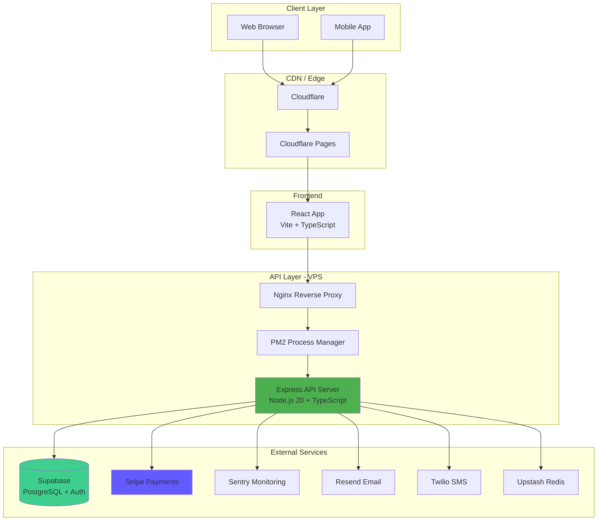
```mermaid
graph TB
    subgraph "Client Layer"
        WEB[Web Browser]
        MOBILE[Mobile App]
    end

    subgraph "CDN / Edge"
        CF[Cloudflare]
        CFPAGES[Cloudflare Pages]
    end

    subgraph "Frontend"
        REACT[React App<br/>Vite + TypeScript]
    end

    subgraph "API Layer - VPS"
        NGINX[Nginx Reverse Proxy]
        PM2[PM2 Process Manager]
        API[Express API Server<br/>Node.js 20 + TypeScript]
    end

    subgraph "External Services"
        SUPABASE[(Supabase<br/>PostgreSQL + Auth)]
        STRIPE[Stripe Payments]
        SENTRY[Sentry Monitoring]
        RESEND[Resend Email]
        TWILIO[Twilio SMS]
        UPSTASH[Upstash Redis]
    end

    WEB --> CF
    MOBILE --> CF
    CF --> CFPAGES
    CFPAGES --> REACT
    REACT --> NGINX
    NGINX --> PM2
    PM2 --> API

    API --> SUPABASE
    API --> STRIPE
    API --> SENTRY
    API --> RESEND
    API --> TWILIO
    API --> UPSTASH

    style API fill:#4CAF50
    style SUPABASE fill:#3ECF8E
    style STRIPE fill:#635BFF
```

---

## Infrastructure Architecture

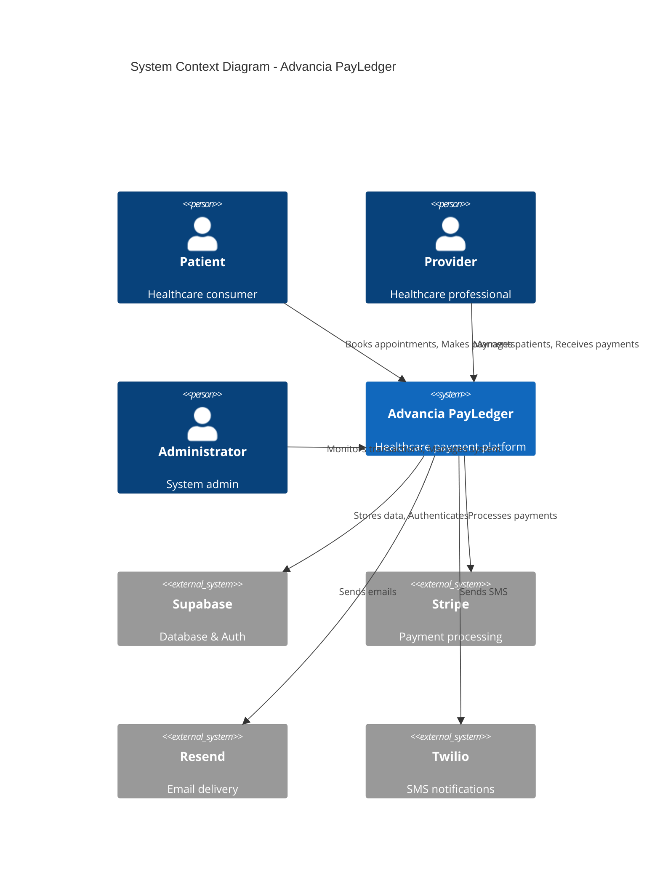
```mermaid
C4Context
    title System Context Diagram - Advancia PayLedger

    Person(patient, "Patient", "Healthcare consumer")
    Person(provider, "Provider", "Healthcare professional")
    Person(admin, "Administrator", "System admin")

    System(advancia, "Advancia PayLedger", "Healthcare payment platform")

    System_Ext(supabase, "Supabase", "Database & Auth")
    System_Ext(stripe, "Stripe", "Payment processing")
    System_Ext(email, "Resend", "Email delivery")
    System_Ext(sms, "Twilio", "SMS notifications")

    Rel(patient, advancia, "Books appointments, Makes payments")
    Rel(provider, advancia, "Manages patients, Receives payments")
    Rel(admin, advancia, "Monitors transactions, Manages system")

    Rel(advancia, supabase, "Stores data, Authenticates")
    Rel(advancia, stripe, "Processes payments")
    Rel(advancia, email, "Sends emails")
    Rel(advancia, sms, "Sends SMS")
```

### Deployment Architecture

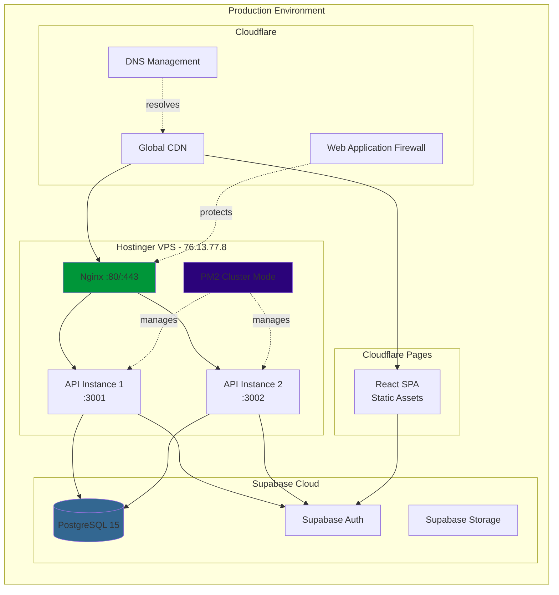
```mermaid
graph LR
    subgraph "Production Environment"
        subgraph "Hostinger VPS - 76.13.77.8"
            NGINX[Nginx :80/:443]
            API1[API Instance 1<br/>:3001]
            API2[API Instance 2<br/>:3002]
            PM2[PM2 Cluster Mode]

            NGINX --> API1
            NGINX --> API2
            PM2 -.manages.-> API1
            PM2 -.manages.-> API2
        end

        subgraph "Cloudflare Pages"
            FRONTEND[React SPA<br/>Static Assets]
        end

        subgraph "Supabase Cloud"
            POSTGRES[(PostgreSQL 15)]
            AUTH[Supabase Auth]
            STORAGE[Supabase Storage]
        end

        subgraph "Cloudflare"
            DNS[DNS Management]
            CDN[Global CDN]
            WAF[Web Application Firewall]
        end
    end

    CDN --> FRONTEND
    CDN --> NGINX
    DNS -.resolves.-> CDN
    WAF -.protects.-> NGINX

    API1 --> POSTGRES
    API2 --> POSTGRES
    API1 --> AUTH
    API2 --> AUTH
    FRONTEND --> AUTH

    style NGINX fill:#009639
    style PM2 fill:#2B037A
    style POSTGRES fill:#336791
```

---

## Application Architecture

```mermaid
graph TB
    subgraph "Express API Server"
        ENTRY[server.ts<br/>Entry Point]

        subgraph "Middleware Layer"
            MW1[Request ID & Logging]
            MW2[Security Headers]
            MW3[CORS]
            MW4[Rate Limiting]
            MW5[Authentication]
            MW6[CSRF Protection]
        end

        subgraph "Routes"
            AUTH_R[/auth/*<br/>Authentication]
            STRIPE_R[/stripe/*<br/>Payments]
            CONNECT_R[/connect/*<br/>Provider Onboarding]
            ADMIN_R[/admin/*<br/>Admin Dashboard]
            APPT_R[/appointments/*<br/>Scheduling]
            PROVIDER_R[/provider/*<br/>Provider Features]
            WALLET_R[/wallet/*<br/>Crypto Wallets]
            MEDBED_R[/medbeds/*<br/>MedBed Sessions]
        end

        subgraph "Services"
            AUTH_S[Auth Service]
            STRIPE_S[Stripe Service]
            EMAIL_S[Email Service]
            SMS_S[SMS Service]
            WALLET_S[Wallet Service]
            MEDBED_S[MedBed Service]
            SECURITY_S[Security Service]
            MONITOR_S[Monitoring Service]
        end

        subgraph "Data Access"
            SUPABASE_CLIENT[Supabase Client]
            REDIS_CLIENT[Redis Client]
        end
    end

    ENTRY --> MW1 --> MW2 --> MW3 --> MW4 --> MW5 --> MW6

    MW6 --> AUTH_R
    MW6 --> STRIPE_R
    MW6 --> CONNECT_R
    MW6 --> ADMIN_R
    MW6 --> APPT_R
    MW6 --> PROVIDER_R
    MW6 --> WALLET_R
    MW6 --> MEDBED_R

    AUTH_R --> AUTH_S
    STRIPE_R --> STRIPE_S
    AUTH_R --> EMAIL_S
    AUTH_R --> SMS_S
    WALLET_R --> WALLET_S
    MEDBED_R --> MEDBED_S

    AUTH_S --> SUPABASE_CLIENT
    STRIPE_S --> SUPABASE_CLIENT
    WALLET_S --> SUPABASE_CLIENT
    MEDBED_S --> SUPABASE_CLIENT

    MW4 --> REDIS_CLIENT
    AUTH_S --> REDIS_CLIENT

    style ENTRY fill:#FF6B6B
    style SUPABASE_CLIENT fill:#3ECF8E
    style REDIS_CLIENT fill:#DC382D
```

---

## Database Architecture

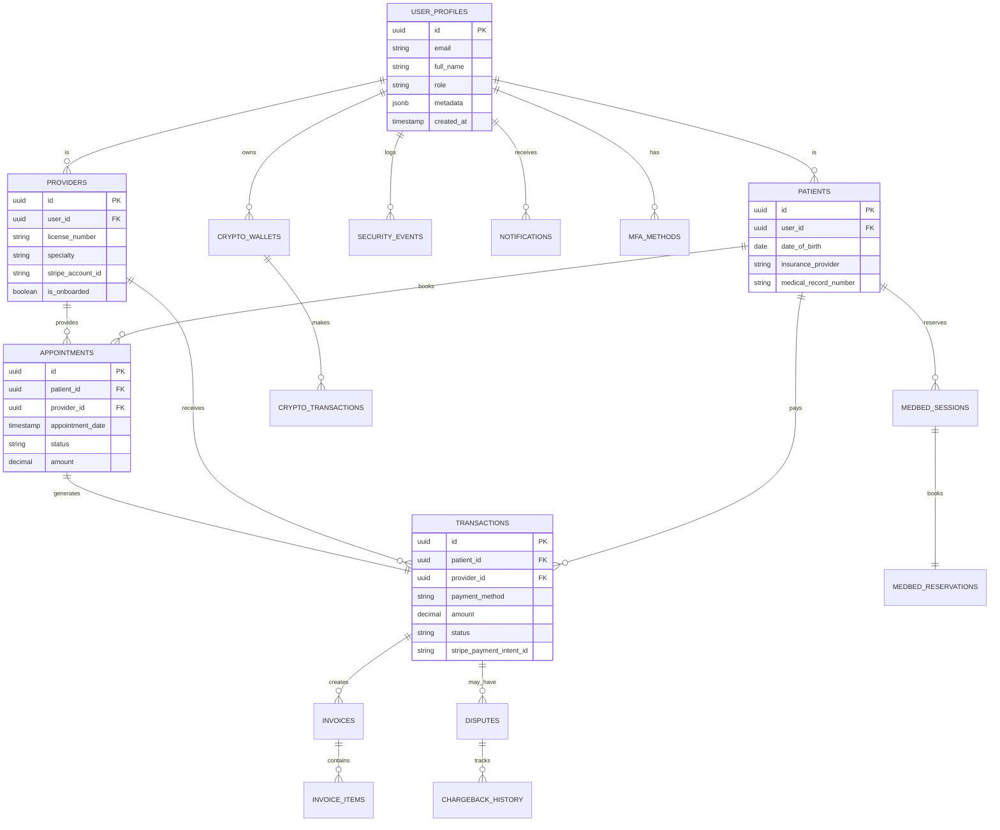
```mermaid
erDiagram
    USER_PROFILES ||--o{ PATIENTS : "is"
    USER_PROFILES ||--o{ PROVIDERS : "is"
    USER_PROFILES ||--o{ SECURITY_EVENTS : "logs"
    USER_PROFILES ||--o{ NOTIFICATIONS : "receives"
    USER_PROFILES ||--o{ MFA_METHODS : "has"

    PATIENTS ||--o{ APPOINTMENTS : "books"
    PATIENTS ||--o{ TRANSACTIONS : "pays"
    PATIENTS ||--o{ MEDBED_SESSIONS : "reserves"

    PROVIDERS ||--o{ APPOINTMENTS : "provides"
    PROVIDERS ||--o{ TRANSACTIONS : "receives"
    PROVIDERS {
        uuid id PK
        uuid user_id FK
        string license_number
        string specialty
        string stripe_account_id
        boolean is_onboarded
    }

    APPOINTMENTS ||--|| TRANSACTIONS : "generates"
    APPOINTMENTS {
        uuid id PK
        uuid patient_id FK
        uuid provider_id FK
        timestamp appointment_date
        string status
        decimal amount
    }

    TRANSACTIONS ||--o{ INVOICES : "creates"
    TRANSACTIONS ||--o{ DISPUTES : "may_have"
    TRANSACTIONS {
        uuid id PK
        uuid patient_id FK
        uuid provider_id FK
        string payment_method
        decimal amount
        string status
        string stripe_payment_intent_id
    }

    INVOICES ||--o{ INVOICE_ITEMS : "contains"

    DISPUTES ||--o{ CHARGEBACK_HISTORY : "tracks"

    CRYPTO_WALLETS ||--o{ CRYPTO_TRANSACTIONS : "makes"
    USER_PROFILES ||--o{ CRYPTO_WALLETS : "owns"

    MEDBED_SESSIONS ||--|| MEDBED_RESERVATIONS : "books"

    USER_PROFILES {
        uuid id PK
        string email
        string full_name
        string role
        jsonb metadata
        timestamp created_at
    }

    PATIENTS {
        uuid id PK
        uuid user_id FK
        date date_of_birth
        string insurance_provider
        string medical_record_number
    }
```

### Table Categories Overview

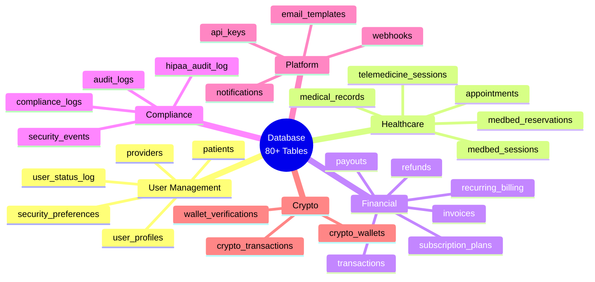
```mermaid
mindmap
  root((Database<br/>80+ Tables))
    User Management
      user_profiles
      patients
      providers
      user_status_log
      security_preferences
    Healthcare
      appointments
      medical_records
      medbed_sessions
      medbed_reservations
      telemedicine_sessions
    Financial
      transactions
      invoices
      recurring_billing
      refunds
      payouts
      subscription_plans
    Compliance
      audit_logs
      hipaa_audit_log
      compliance_logs
      security_events
    Platform
      notifications
      webhooks
      api_keys
      email_templates
    Crypto
      crypto_wallets
      crypto_transactions
      wallet_verifications
```

---

## Security Architecture

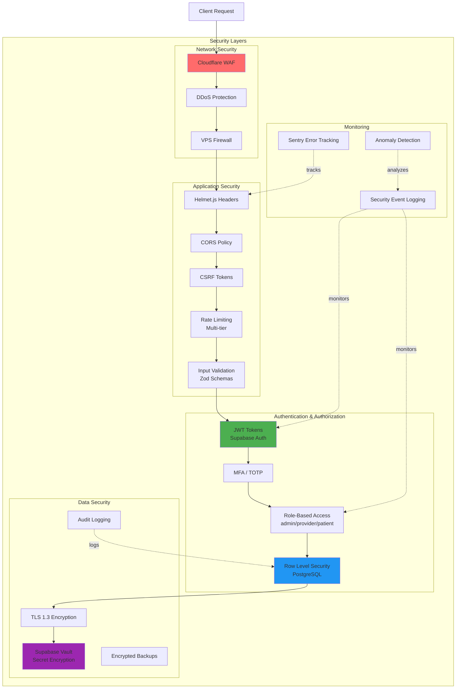
```mermaid
graph TB
    subgraph "Security Layers"
        subgraph "Network Security"
            WAF[Cloudflare WAF]
            DDOS[DDoS Protection]
            FIREWALL[VPS Firewall]
        end

        subgraph "Application Security"
            HELMET[Helmet.js Headers]
            CORS_M[CORS Policy]
            CSRF_M[CSRF Tokens]
            RATELIMIT[Rate Limiting<br/>Multi-tier]
            INPUT_VAL[Input Validation<br/>Zod Schemas]
        end

        subgraph "Authentication & Authorization"
            JWT[JWT Tokens<br/>Supabase Auth]
            MFA_AUTH[MFA / TOTP]
            RBAC[Role-Based Access<br/>admin/provider/patient]
            RLS[Row Level Security<br/>PostgreSQL]
        end

        subgraph "Data Security"
            TLS[TLS 1.3 Encryption]
            VAULT[Supabase Vault<br/>Secret Encryption]
            BACKUP[Encrypted Backups]
            AUDIT[Audit Logging]
        end

        subgraph "Monitoring"
            SENTRY_M[Sentry Error Tracking]
            SECURITY_LOG[Security Event Logging]
            ANOMALY[Anomaly Detection]
        end
    end

    CLIENT[Client Request] --> WAF
    WAF --> DDOS
    DDOS --> FIREWALL
    FIREWALL --> HELMET
    HELMET --> CORS_M
    CORS_M --> CSRF_M
    CSRF_M --> RATELIMIT
    RATELIMIT --> INPUT_VAL
    INPUT_VAL --> JWT
    JWT --> MFA_AUTH
    MFA_AUTH --> RBAC
    RBAC --> RLS
    RLS --> TLS
    TLS --> VAULT

    SECURITY_LOG -.monitors.-> JWT
    SECURITY_LOG -.monitors.-> RBAC
    ANOMALY -.analyzes.-> SECURITY_LOG
    SENTRY_M -.tracks.-> HELMET
    AUDIT -.logs.-> RLS

    style WAF fill:#FF6B6B
    style JWT fill:#4CAF50
    style RLS fill:#2196F3
    style VAULT fill:#9C27B0
```

### Security Controls Matrix

| Layer           | Control                  | Technology        | Status     |
| --------------- | ------------------------ | ----------------- | ---------- |
| **Network**     | DDoS Protection          | Cloudflare        | ⏳ Pending |
| **Network**     | Web Application Firewall | Cloudflare        | ⏳ Pending |
| **Network**     | TLS 1.3                  | Let's Encrypt     | ⏳ Pending |
| **Application** | Security Headers         | Helmet.js         | ✅ Active  |
| **Application** | CORS                     | Express CORS      | ✅ Active  |
| **Application** | CSRF Protection          | Custom Middleware | ✅ Active  |
| **Application** | Rate Limiting            | Upstash/Memory    | ✅ Active  |
| **Application** | Input Validation         | Zod               | ✅ Active  |
| **Auth**        | JWT Authentication       | Supabase Auth     | ✅ Active  |
| **Auth**        | Multi-Factor Auth        | TOTP              | ✅ Active  |
| **Auth**        | Role-Based Access        | Custom RBAC       | ✅ Active  |
| **Database**    | Row Level Security       | PostgreSQL RLS    | ✅ Active  |
| **Database**    | Encrypted Secrets        | Supabase Vault    | ✅ Active  |
| **Database**    | Audit Logging            | Triggers          | ✅ Active  |
| **Monitoring**  | Error Tracking           | Sentry            | ✅ Active  |
| **Monitoring**  | Security Events          | Custom Service    | ✅ Active  |

---

## Payment Processing Flow

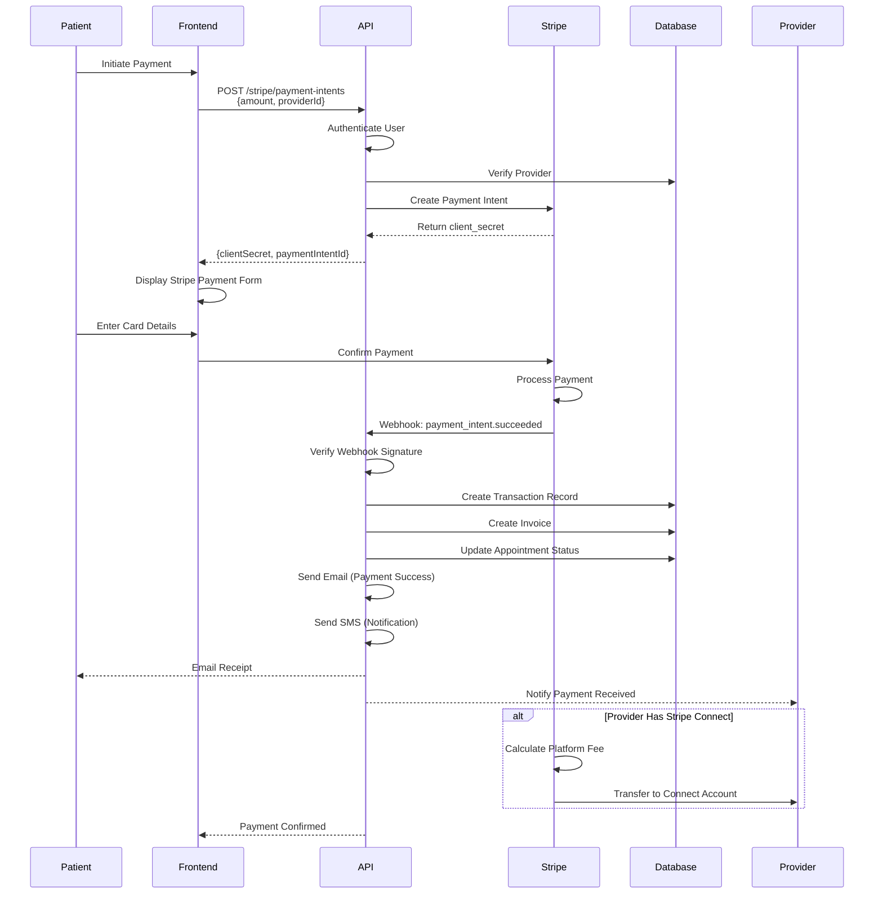
```mermaid
sequenceDiagram
    participant Patient
    participant Frontend
    participant API
    participant Stripe
    participant Database
    participant Provider

    Patient->>Frontend: Initiate Payment
    Frontend->>API: POST /stripe/payment-intents<br/>{amount, providerId}

    API->>API: Authenticate User
    API->>Database: Verify Provider

    API->>Stripe: Create Payment Intent
    Stripe-->>API: Return client_secret
    API-->>Frontend: {clientSecret, paymentIntentId}

    Frontend->>Frontend: Display Stripe Payment Form
    Patient->>Frontend: Enter Card Details
    Frontend->>Stripe: Confirm Payment

    Stripe->>Stripe: Process Payment
    Stripe->>API: Webhook: payment_intent.succeeded

    API->>API: Verify Webhook Signature
    API->>Database: Create Transaction Record
    API->>Database: Create Invoice
    API->>Database: Update Appointment Status

    API->>API: Send Email (Payment Success)
    API->>API: Send SMS (Notification)

    API-->>Patient: Email Receipt
    API-->>Provider: Notify Payment Received

    alt Provider Has Stripe Connect
        Stripe->>Stripe: Calculate Platform Fee
        Stripe->>Provider: Transfer to Connect Account
    end

    API-->>Frontend: Payment Confirmed
```

### Provider Onboarding Flow (Stripe Connect)

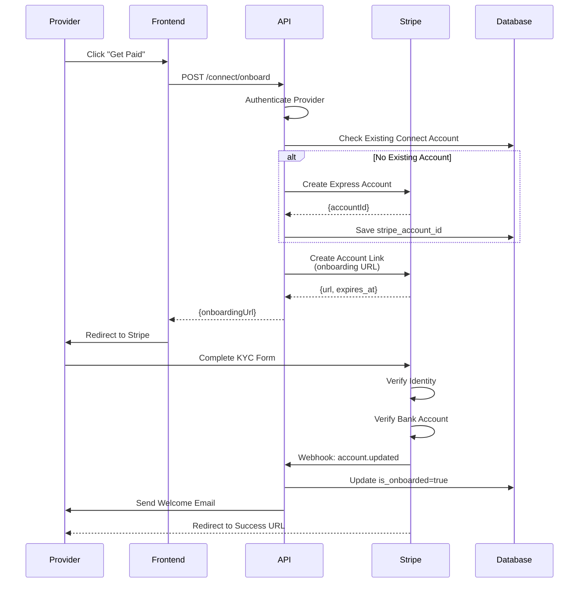
```mermaid
sequenceDiagram
    participant Provider
    participant Frontend
    participant API
    participant Stripe
    participant Database

    Provider->>Frontend: Click "Get Paid"
    Frontend->>API: POST /connect/onboard

    API->>API: Authenticate Provider
    API->>Database: Check Existing Connect Account

    alt No Existing Account
        API->>Stripe: Create Express Account
        Stripe-->>API: {accountId}
        API->>Database: Save stripe_account_id
    end

    API->>Stripe: Create Account Link<br/>(onboarding URL)
    Stripe-->>API: {url, expires_at}
    API-->>Frontend: {onboardingUrl}

    Frontend->>Provider: Redirect to Stripe
    Provider->>Stripe: Complete KYC Form
    Stripe->>Stripe: Verify Identity
    Stripe->>Stripe: Verify Bank Account

    Stripe->>API: Webhook: account.updated
    API->>Database: Update is_onboarded=true

    API->>Provider: Send Welcome Email

    Stripe-->>Provider: Redirect to Success URL
```

---

## Authentication Flow

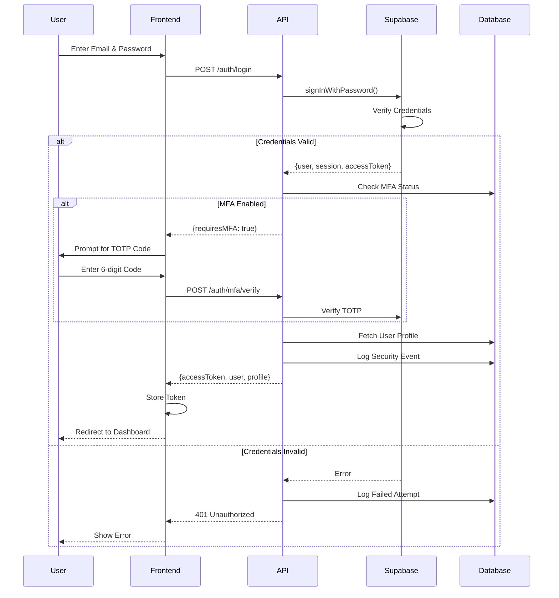
```mermaid
sequenceDiagram
    participant User
    participant Frontend
    participant API
    participant Supabase
    participant Database

    User->>Frontend: Enter Email & Password
    Frontend->>API: POST /auth/login

    API->>Supabase: signInWithPassword()
    Supabase->>Supabase: Verify Credentials

    alt Credentials Valid
        Supabase-->>API: {user, session, accessToken}
        API->>Database: Check MFA Status

        alt MFA Enabled
            API-->>Frontend: {requiresMFA: true}
            Frontend->>User: Prompt for TOTP Code
            User->>Frontend: Enter 6-digit Code
            Frontend->>API: POST /auth/mfa/verify
            API->>Supabase: Verify TOTP
        end

        API->>Database: Fetch User Profile
        API->>Database: Log Security Event

        API-->>Frontend: {accessToken, user, profile}
        Frontend->>Frontend: Store Token
        Frontend-->>User: Redirect to Dashboard
    else Credentials Invalid
        Supabase-->>API: Error
        API->>Database: Log Failed Attempt
        API-->>Frontend: 401 Unauthorized
        Frontend-->>User: Show Error
    end
```

### Role-Based Access Control

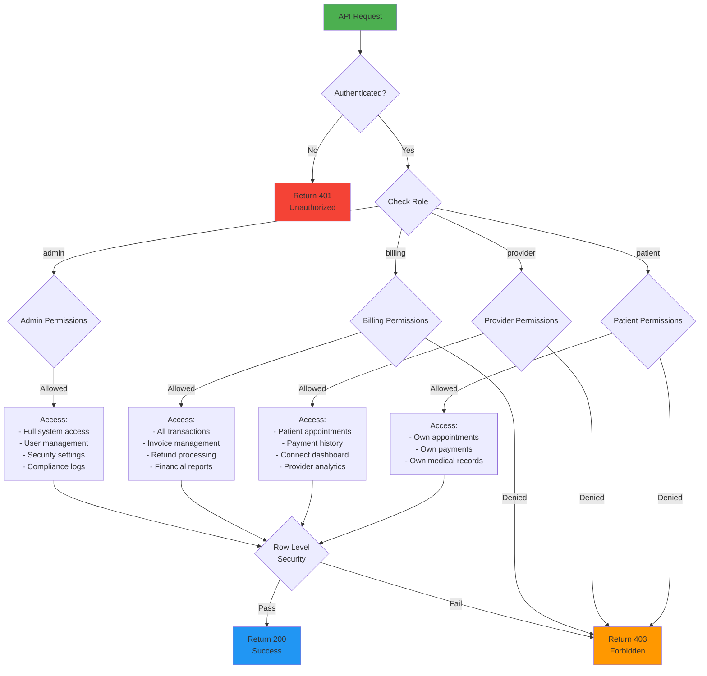
```mermaid
flowchart TD
    START[API Request] --> AUTH{Authenticated?}
    AUTH -->|No| RETURN_401[Return 401<br/>Unauthorized]
    AUTH -->|Yes| CHECK_ROLE{Check Role}

    CHECK_ROLE -->|patient| PATIENT_PERM{Patient Permissions}
    CHECK_ROLE -->|provider| PROVIDER_PERM{Provider Permissions}
    CHECK_ROLE -->|billing| BILLING_PERM{Billing Permissions}
    CHECK_ROLE -->|admin| ADMIN_PERM{Admin Permissions}

    PATIENT_PERM -->|Allowed| ACCESS_PATIENT[Access:<br/>- Own appointments<br/>- Own payments<br/>- Own medical records]
    PATIENT_PERM -->|Denied| RETURN_403[Return 403<br/>Forbidden]

    PROVIDER_PERM -->|Allowed| ACCESS_PROVIDER[Access:<br/>- Patient appointments<br/>- Payment history<br/>- Connect dashboard<br/>- Provider analytics]
    PROVIDER_PERM -->|Denied| RETURN_403

    BILLING_PERM -->|Allowed| ACCESS_BILLING[Access:<br/>- All transactions<br/>- Invoice management<br/>- Refund processing<br/>- Financial reports]
    BILLING_PERM -->|Denied| RETURN_403

    ADMIN_PERM -->|Allowed| ACCESS_ADMIN[Access:<br/>- Full system access<br/>- User management<br/>- Security settings<br/>- Compliance logs]

    ACCESS_PATIENT --> RLS{Row Level<br/>Security}
    ACCESS_PROVIDER --> RLS
    ACCESS_BILLING --> RLS
    ACCESS_ADMIN --> RLS

    RLS -->|Pass| RETURN_200[Return 200<br/>Success]
    RLS -->|Fail| RETURN_403

    style START fill:#4CAF50
    style RETURN_401 fill:#F44336
    style RETURN_403 fill:#FF9800
    style RETURN_200 fill:#2196F3
```

---

## Data Flow Diagrams

### Transaction Processing Data Flow

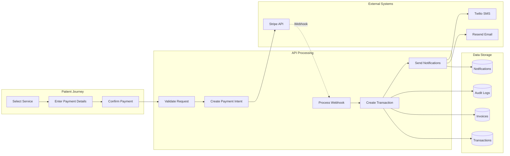
```mermaid
flowchart LR
    subgraph "Patient Journey"
        P1[Select Service]
        P2[Enter Payment Details]
        P3[Confirm Payment]
    end

    subgraph "API Processing"
        A1[Validate Request]
        A2[Create Payment Intent]
        A3[Process Webhook]
        A4[Create Transaction]
        A5[Send Notifications]
    end

    subgraph "Data Storage"
        DB1[(Transactions)]
        DB2[(Invoices)]
        DB3[(Audit Logs)]
        DB4[(Notifications)]
    end

    subgraph "External Systems"
        S1[Stripe API]
        S2[Resend Email]
        S3[Twilio SMS]
    end

    P1 --> P2 --> P3
    P3 --> A1
    A1 --> A2
    A2 --> S1
    S1 -.Webhook.-> A3
    A3 --> A4
    A4 --> DB1
    A4 --> DB2
    A4 --> DB3
    A4 --> A5
    A5 --> DB4
    A5 --> S2
    A5 --> S3
```

### Appointment Booking Flow

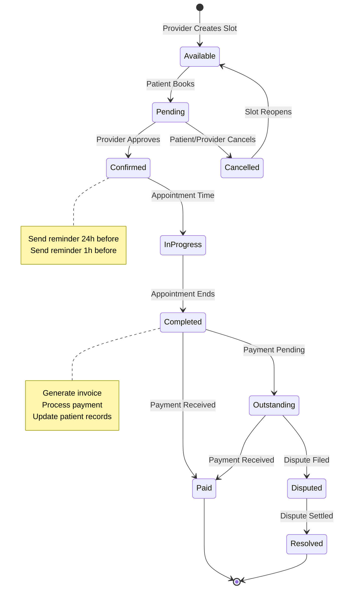
```mermaid
stateDiagram-v2
    [*] --> Available: Provider Creates Slot
    Available --> Pending: Patient Books
    Pending --> Confirmed: Provider Approves
    Pending --> Cancelled: Patient/Provider Cancels
    Confirmed --> InProgress: Appointment Time
    InProgress --> Completed: Appointment Ends
    Completed --> Paid: Payment Received
    Completed --> Outstanding: Payment Pending
    Outstanding --> Paid: Payment Received
    Outstanding --> Disputed: Dispute Filed
    Disputed --> Resolved: Dispute Settled
    Cancelled --> Available: Slot Reopens
    Paid --> [*]
    Resolved --> [*]

    note right of Confirmed
        Send reminder 24h before
        Send reminder 1h before
    end note

    note right of Completed
        Generate invoice
        Process payment
        Update patient records
    end note
```

---

## Technology Stack Details

### Backend Technologies

```mermaid
graph LR
    subgraph "Runtime"
        NODE[Node.js 22 LTS]
    end

    subgraph "Framework"
        EXPRESS[Express 5]
        TYPESCRIPT[TypeScript 5.9]
    end

    subgraph "Validation"
        ZOD[Zod 4.x]
    end

    subgraph "Build Tools"
        ESBUILD[esbuild]
        TSX[tsx]
    end

    subgraph "Testing"
        JEST[Jest 30]
        PLAYWRIGHT[Playwright]
    end

    subgraph "Code Quality"
        ESLINT[ESLint 10]
        PRETTIER[Prettier]
        HUSKY[Husky]
    end

    NODE --> EXPRESS
    TYPESCRIPT --> EXPRESS
    EXPRESS --> ZOD
    TYPESCRIPT --> ESBUILD
    TYPESCRIPT --> TSX
    JEST --> TYPESCRIPT
    PLAYWRIGHT --> TYPESCRIPT

    style NODE fill:#3C873A
    style EXPRESS fill:#000000
    style TYPESCRIPT fill:#3178C6
```

### Frontend Technologies

```mermaid
graph LR
    subgraph "UI Framework"
        REACT[React 19]
        VITE[Vite 5]
    end

    subgraph "Routing"
        ROUTER[React Router 7]
    end

    subgraph "State Management"
        CONTEXT[React Context]
        HOOKS[Custom Hooks]
    end

    subgraph "UI Components"
        STRIPE_UI[@stripe/react-stripe-js]
        CHARTS[Recharts]
    end

    subgraph "Testing"
        VITEST[Vitest]
        RTL[@testing-library/react]
    end

    VITE --> REACT
    REACT --> ROUTER
    REACT --> CONTEXT
    CONTEXT --> HOOKS
    REACT --> STRIPE_UI
    REACT --> CHARTS
    VITEST --> REACT
    RTL --> REACT

    style REACT fill:#61DAFB
    style VITE fill:#646CFF
```

---

## Performance Optimization

### Caching Strategy

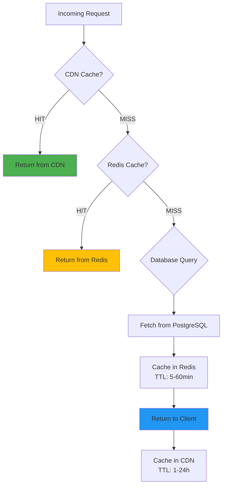
```mermaid
graph TB
    REQUEST[Incoming Request]

    REQUEST --> CDN{CDN Cache?}
    CDN -->|HIT| RETURN_CDN[Return from CDN]
    CDN -->|MISS| REDIS{Redis Cache?}

    REDIS -->|HIT| RETURN_REDIS[Return from Redis]
    REDIS -->|MISS| DB{Database Query}

    DB --> FETCH[Fetch from PostgreSQL]
    FETCH --> CACHE_REDIS[Cache in Redis<br/>TTL: 5-60min]
    CACHE_REDIS --> RETURN_DB[Return to Client]

    RETURN_DB --> CACHE_CDN[Cache in CDN<br/>TTL: 1-24h]

    style RETURN_CDN fill:#4CAF50
    style RETURN_REDIS fill:#FFC107
    style RETURN_DB fill:#2196F3
```

### Rate Limiting Tiers

| Tier               | Window     | Max Requests | Applies To                      |
| ------------------ | ---------- | ------------ | ------------------------------- |
| **Authentication** | 15 minutes | 10           | `/auth/login`, `/auth/register` |
| **Payments**       | 1 minute   | 10           | `/stripe/*` payment endpoints   |
| **Sensitive**      | 1 hour     | 20           | MFA, password reset             |
| **API General**    | 15 minutes | 100          | All other `/api/v1/*`           |
| **Webhooks**       | 1 minute   | 1000         | Stripe webhooks                 |

---

## Monitoring & Observability

```mermaid
graph TB
    subgraph "Application Monitoring"
        SENTRY[Sentry<br/>Error Tracking]
        LOGS[Winston Logs<br/>Structured JSON]
        METRICS[Custom Metrics<br/>Performance]
    end

    subgraph "Infrastructure Monitoring"
        SERVER[Server Metrics<br/>CPU, Memory, Disk]
        DATABASE[Database Metrics<br/>Queries, Connections]
        REDIS_M[Redis Metrics<br/>Hit Rate, Memory]
    end

    subgraph "Business Monitoring"
        TRANSACTIONS[Transaction Volume]
        ERRORS[Error Rates]
        LATENCY[API Latency]
        USERS[Active Users]
    end

    subgraph "Alerts"
        EMAIL_ALERT[Email Alerts]
        SMS_ALERT[SMS Alerts]
        SLACK_ALERT[Slack Notifications]
    end

    SENTRY --> ERRORS
    LOGS --> LATENCY
    METRICS --> LATENCY

    SERVER --> ALERTS
    DATABASE --> ALERTS
    ERRORS --> ALERTS
    LATENCY --> ALERTS

    ALERTS --> EMAIL_ALERT
    ALERTS --> SMS_ALERT
    ALERTS --> SLACK_ALERT

    style SENTRY fill:#362D59
    style ALERTS fill:#FF6B6B
```

---

## Disaster Recovery

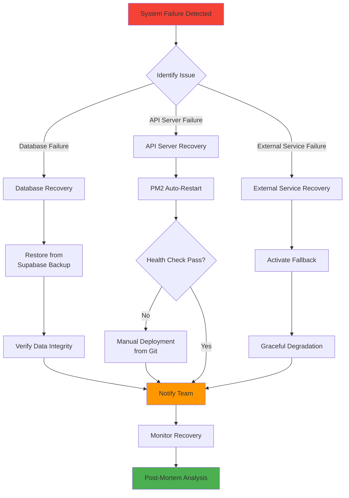
```mermaid
flowchart TD
    START[System Failure Detected]

    START --> IDENTIFY{Identify Issue}

    IDENTIFY -->|Database Failure| DB_RECOVERY[Database Recovery]
    IDENTIFY -->|API Server Failure| API_RECOVERY[API Server Recovery]
    IDENTIFY -->|External Service Failure| EXT_RECOVERY[External Service Recovery]

    DB_RECOVERY --> DB_RESTORE[Restore from<br/>Supabase Backup]
    DB_RESTORE --> DB_VERIFY[Verify Data Integrity]
    DB_VERIFY --> NOTIFY_TEAM

    API_RECOVERY --> PM2_RESTART[PM2 Auto-Restart]
    PM2_RESTART --> HEALTH_CHECK{Health Check Pass?}
    HEALTH_CHECK -->|No| MANUAL_DEPLOY[Manual Deployment<br/>from Git]
    HEALTH_CHECK -->|Yes| NOTIFY_TEAM

    EXT_RECOVERY --> FALLBACK[Activate Fallback]
    FALLBACK --> DEGRADE[Graceful Degradation]
    DEGRADE --> NOTIFY_TEAM[Notify Team]

    MANUAL_DEPLOY --> NOTIFY_TEAM

    NOTIFY_TEAM --> MONITOR[Monitor Recovery]
    MONITOR --> POSTMORTEM[Post-Mortem Analysis]

    style START fill:#F44336
    style NOTIFY_TEAM fill:#FF9800
    style POSTMORTEM fill:#4CAF50
```

### Backup Strategy

| Data Type              | Frequency | Retention | Location           |
| ---------------------- | --------- | --------- | ------------------ |
| **Database**           | Hourly    | 30 days   | Supabase Automated |
| **User Uploads**       | Daily     | 90 days   | Supabase Storage   |
| **Application Logs**   | Real-time | 14 days   | Sentry / Local     |
| **Code Repository**    | On commit | Forever   | GitHub             |
| **Environment Config** | On change | Forever   | Secure Vault       |

---

## Scalability Considerations

### Horizontal Scaling

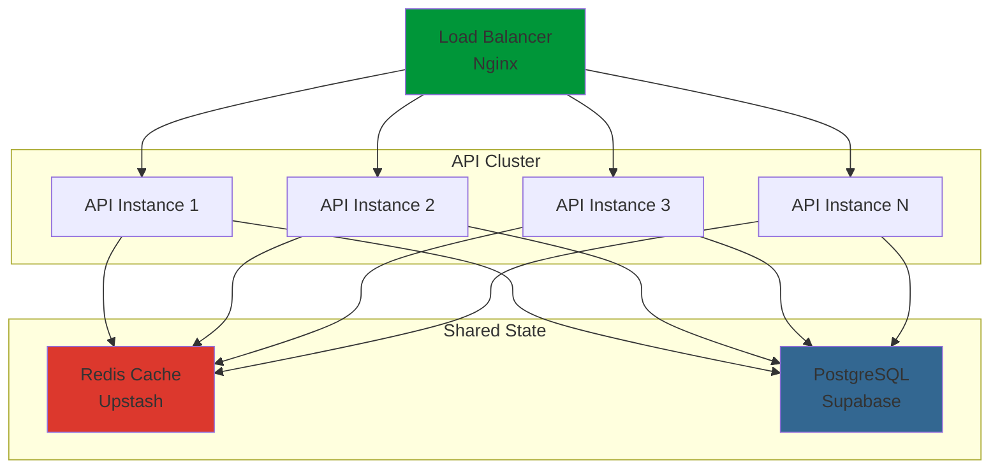
```mermaid
graph TB
    LB[Load Balancer<br/>Nginx]

    subgraph "API Cluster"
        API1[API Instance 1]
        API2[API Instance 2]
        API3[API Instance 3]
        APIN[API Instance N]
    end

    subgraph "Shared State"
        REDIS[Redis Cache<br/>Upstash]
        DB[PostgreSQL<br/>Supabase]
    end

    LB --> API1
    LB --> API2
    LB --> API3
    LB --> APIN

    API1 --> REDIS
    API2 --> REDIS
    API3 --> REDIS
    APIN --> REDIS

    API1 --> DB
    API2 --> DB
    API3 --> DB
    APIN --> DB

    style LB fill:#009639
    style REDIS fill:#DC382D
    style DB fill:#336791
```

### Scaling Thresholds

| Metric                   | Warning | Critical | Action                       |
| ------------------------ | ------- | -------- | ---------------------------- |
| **CPU Usage**            | 70%     | 85%      | Add API instance             |
| **Memory Usage**         | 75%     | 90%      | Add API instance             |
| **Database Connections** | 80      | 95       | Scale DB / Add pooling       |
| **API Response Time**    | 200ms   | 500ms    | Optimize queries / Add cache |
| **Error Rate**           | 1%      | 5%       | Investigate & fix            |

---

## Compliance & Audit

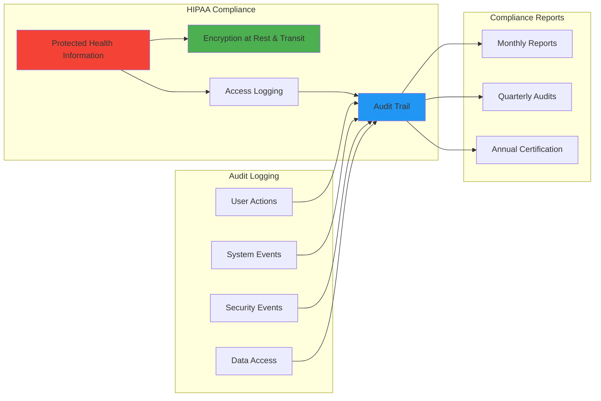
```mermaid
graph LR
    subgraph "HIPAA Compliance"
        PHI[Protected Health Information]
        ENCRYPTION[Encryption at Rest & Transit]
        ACCESS_LOG[Access Logging]
        AUDIT_TRAIL[Audit Trail]
    end

    subgraph "Audit Logging"
        USER_ACTIONS[User Actions]
        SYSTEM_EVENTS[System Events]
        SECURITY_EVENTS[Security Events]
        DATA_ACCESS[Data Access]
    end

    subgraph "Compliance Reports"
        MONTHLY[Monthly Reports]
        QUARTERLY[Quarterly Audits]
        ANNUAL[Annual Certification]
    end

    PHI --> ENCRYPTION
    PHI --> ACCESS_LOG
    ACCESS_LOG --> AUDIT_TRAIL

    USER_ACTIONS --> AUDIT_TRAIL
    SYSTEM_EVENTS --> AUDIT_TRAIL
    SECURITY_EVENTS --> AUDIT_TRAIL
    DATA_ACCESS --> AUDIT_TRAIL

    AUDIT_TRAIL --> MONTHLY
    AUDIT_TRAIL --> QUARTERLY
    AUDIT_TRAIL --> ANNUAL

    style PHI fill:#F44336
    style ENCRYPTION fill:#4CAF50
    style AUDIT_TRAIL fill:#2196F3
```

---

## API Documentation

- **OpenAPI Spec**: [`openapi.yaml`](./openapi.yaml)
- **Swagger UI**: Available at `/docs` endpoint
- **Postman Collection**: Export from OpenAPI spec

For detailed API endpoint documentation, see the [README.md](./README.md#api-endpoints) file.

---

## Related Documentation

- [README.md](./README.md) - Project overview and quick start
- [DEPLOYMENT.md](./DEPLOYMENT.md) - Deployment instructions
- [SECURITY.md](./SECURITY.md) - Security policies
- [DEV_SETUP.md](./DEV_SETUP.md) - Development environment setup
- [PRODUCTION_CONFIG.md](./PRODUCTION_CONFIG.md) - Production configuration

---

**Last Updated**: February 24, 2026  
**Version**: 1.0.0  
**Maintained By**: Modullar Advancia Team
